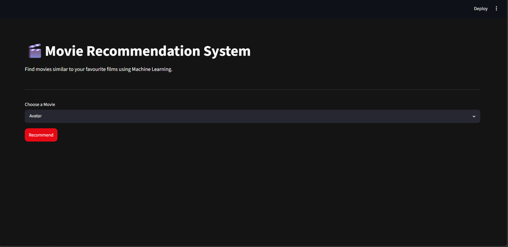
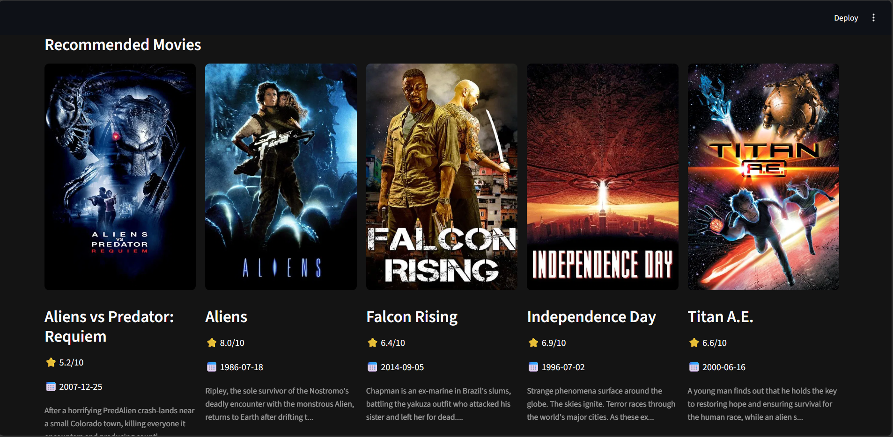

# 🎬 Movie Recommendation System

A **Content-Based Movie Recommendation System** built using **Python**, **Machine Learning**, **Streamlit**, and the **TMDB API**. This application recommends movies similar to the one selected by the user and displays detailed movie information such as posters, ratings, release dates, and descriptions in a modern Netflix-inspired interface.

---

## 📸 Preview

> *(Add screenshots of your application here)*

### Home Page


### Recommendations


---

# 🚀 Features

- 🎥 Content-Based Movie Recommendation
- ⭐ TMDB Movie Ratings
- 🖼️ Movie Posters
- 📅 Release Date
- 📝 Movie Overview
- 🔍 Searchable Movie Selection
- 🎨 Netflix Inspired Dark UI
- ⚡ Fast Recommendations using Cosine Similarity
- 🌐 TMDB API Integration
- 📱 Responsive Streamlit Interface

---

# 🛠 Tech Stack

### Programming Language
- Python

### Machine Learning
- Scikit-learn
- Cosine Similarity

### Data Processing
- Pandas
- NumPy

### Frontend
- Streamlit

### API
- TMDB (The Movie Database)

### Serialization
- Joblib

---

# 📂 Project Structure

```text
Movie-Recommendation-System/
│
├── app.py
├── movie_list.joblib
├── similarity.joblib
├── requirements.txt
├── README.md
├── .streamlit
│   └── secrets.toml
│
├── screenshots
│   ├── home.png
│   └── recommendations.png
│
└── dataset
    └── movies.csv
```

---

# 🧠 Machine Learning Workflow

1. Load Movie Dataset
2. Clean and preprocess data
3. Combine important features
4. Vectorize movie information
5. Compute Cosine Similarity Matrix
6. Save processed data using Joblib
7. Recommend Top 5 Similar Movies
8. Fetch movie details from TMDB API

---

# 🔍 Recommendation Algorithm

This project uses a **Content-Based Filtering** approach.

Movies are recommended based on similarities in:

- Genres
- Keywords
- Cast
- Crew
- Movie Overview

The textual information is converted into vectors using:

- CountVectorizer

Similarity between movies is calculated using:

- Cosine Similarity

---

# 🎬 Movie Information from TMDB

The application fetches real-time movie information from TMDB including:

- Movie Poster
- Rating
- Release Date
- Movie Description
- Movie Title

---

# 📦 Installation

Clone the repository

```bash
git clone https://github.com/yourusername/Movie-Recommendation-System.git
```

Go to the project directory

```bash
cd Movie-Recommendation-System
```

Install dependencies

```bash
pip install -r requirements.txt
```

---

# 🔑 TMDB API Setup

Create a free account on TMDB

https://www.themoviedb.org/

Generate an API Key.

Create a folder named

```text
.streamlit
```

Inside it create

```text
secrets.toml
```

Add your API key

```toml
TMDB_API_KEY="YOUR_API_KEY"
```

---

# ▶️ Run the Application

```bash
streamlit run app.py
```

The application will start on

```
http://localhost:8501
```

---

# 📚 Libraries Used

- streamlit
- pandas
- numpy
- requests
- joblib
- scikit-learn

Install manually

```bash
pip install streamlit pandas numpy requests scikit-learn joblib
```

---

# 📈 Future Improvements

- Movie Trailer
- Cast Information
- Director Details
- Genre Filtering
- Trending Movies
- Top Rated Movies
- Similar Movies from TMDB
- Watchlist
- User Authentication
- User Ratings
- Hybrid Recommendation System
- Collaborative Filtering
- Deploy on Streamlit Cloud
- Docker Support

---

# 🎯 Learning Outcomes

Through this project, I learned:

- Machine Learning Recommendation Systems
- Content-Based Filtering
- Cosine Similarity
- Feature Engineering
- API Integration
- Streamlit Development
- Git & GitHub
- Python Project Structure

---

# 📸 Screenshots

| Home | Recommendations |
|------|----------------|
| Add Screenshot | Add Screenshot |

---

# 📊 Dataset

The recommendation model was trained on the TMDB 5000 Movies Dataset.

Dataset includes:

- Movie Title
- Genres
- Keywords
- Cast
- Crew
- Overview

---

# 🌐 API Reference

TMDB API

https://developer.themoviedb.org/

---

# 🤝 Contributing

Contributions are welcome.

1. Fork the repository
2. Create your feature branch

```bash
git checkout -b feature-name
```

3. Commit your changes

```bash
git commit -m "Added new feature"
```

4. Push

```bash
git push origin feature-name
```

5. Create a Pull Request

---

# ⭐ Support

If you found this project useful, consider giving it a ⭐ on GitHub.

---

# 👨‍💻 Author

**Murtuza Hoshiyar**

BCA (Cloud Computing)

- GitHub: https://github.com/yourusername
- LinkedIn: https://linkedin.com/in/yourprofile

---

# 📄 License

This project is licensed under the MIT License.

---

## ⭐ If you like this project, don't forget to star the repository!
